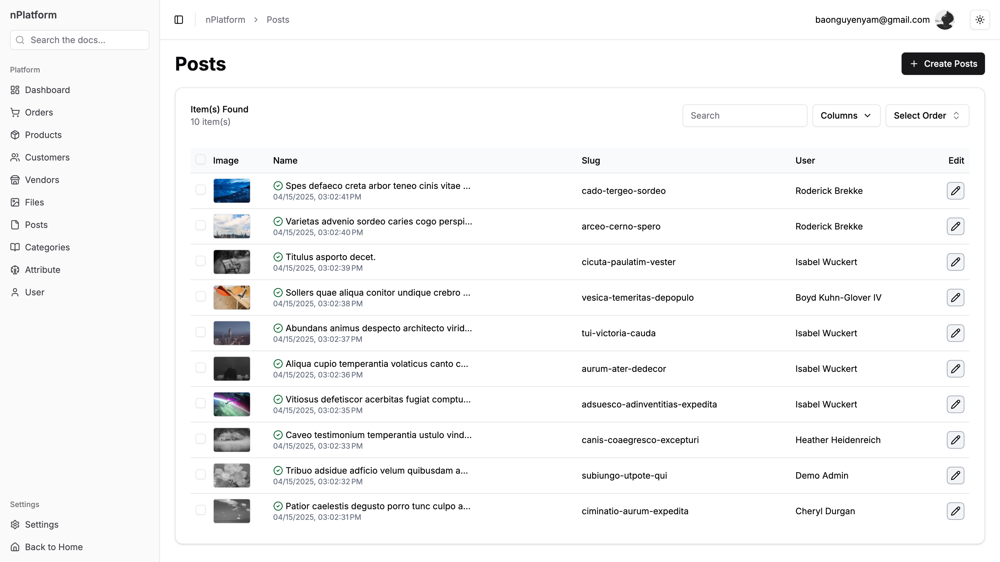

# About this Platform

nPlatform is a platform that provides a set of tools and services to help developers build and deploy applications quickly and efficiently. 



# Key Features Powering the Platform:

- Granular User Role Management: Define and control access with precision.
- Centralized App Settings: Configure and customize the application effortlessly.
- Dynamic Content Hub (Posts/Blogs): Engage your audience with rich, easily managed content.
- Integrated Stakeholder Management (Customers/Vendors): Streamline interactions and relationships.
- Secure File Management: Organize and access digital assets with confidence.
- Efficient Order Processing: Manage the entire order lifecycle seamlessly.
- Comprehensive Product Catalog: Showcase and manage your offerings effectively.
- ... and more capabilities designed for growth.

# Our Current Tech Stack Includes:

- Tailwind CSS v4: We leverage this utility-first CSS framework for rapid and highly customizable UI development, allowing for efficient styling directly within our components.
- Next.js v15: Built upon React, Next.js provides us with a powerful framework for building performant and scalable web applications, offering features like server-side rendering and API routes.
- NextAuth.js v5: We use this comprehensive authentication library to implement secure and flexible user authentication, supporting various providers and strategies.
- Prisma ORM v6: Our data layer is managed with Prisma, a modern ORM that ensures type-safe database access and simplifies database interactions for our Node.js and TypeScript backend.
- Meta Lexical Editor: For rich text editing capabilities, we've integrated the highly extensible and performant Lexical framework, enabling collaborative and feature-rich content creation.
- Radix UI: We utilize this collection of unstyled and accessible UI primitives to build robust and user-friendly interfaces with complete control over styling and behavior.
- Next Themes: Implementing dark mode and other custom themes is streamlined with Next Themes, providing a simple and efficient way to enhance the user experience.
- Lucide Icons: Our interfaces are enriched with beautiful and consistent open-source icons from Lucide, ensuring a clean and professional visual style.
- Zod Form: We employ Zod for robust form validation, defining clear schemas and ensuring type safety for reliable and user-friendly form handling.
- Redux, Redux Persist: For managing complex application state, we use Redux, complemented by Redux Persist to maintain state across user sessions, improving persistence and user experience.
- ...

# Roadmap

- Email Template
- Upload file to R2
- Supabase

# Setup & Running

### Create .env.local 

Copy `.env.sample` to `.env`

Run this command:

```bash
cp .env.sample .env
```

### Add Next Auth Key 

Run this command 

```bash
npx auth secret
```
Then => Yes

### Install component

Run this command

```bash
yarn
```

### Run the app

Run this command 

```bash
sh app.sh
```